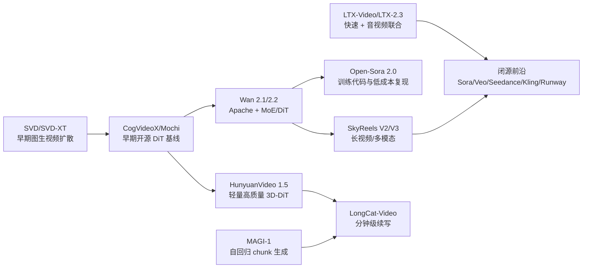

# 视频生成模型调研报告（核验更新版，2026-07-01）

## 执行摘要

本次更新以原 `ChatGPT调研报告.md` 的两张主表为基准，吸收 `gemini调研报告.md` 中较新的模型线索，并通过官方文档、模型卡、GitHub/Hugging Face 页面及第三方盲测榜单交叉核验。核心结论如下：

- 开源方向已经从早期 SVD/CogVideoX/Mochi 过渡到 **Wan2.2、HunyuanVideo-1.5、LTX-2.3、SkyReels V2/V3、LongCat-Video、MAGI-1、Open-Sora 2.0、Step-Video-T2V** 等多路线并行。需要特别注意许可证：SVD、HunyuanVideo、LTX-2/2.3、SkyReels、CogVideoX1.5 权重并非简单 Apache-2.0。
- 闭源方向应将旧表中的 **Sora、Veo、Runway Gen-3/4、Seedance 1.0、Luma Dream Machine** 更新为 **Sora 2/2 Pro（API 已标记弃用）、Veo 3.1/Gemini Omni Flash、Runway Gen-4.5、Seedance 2.0、Kling 3.0、HappyHorse 1.1、Hailuo 2.3、Vidu Q3、Luma Ray3.2、PixVerse V6、Grok Imagine Video** 等。
- 公开“绝对指标”仍然不足。厂商自评、VBench、Artificial Analysis Video Arena 的 Elo 分数口径不同，不能直接混为一谈。报告中已区分“官方/厂商自评”和“第三方盲测”。
- 重要遗漏包括：闭源的 **HappyHorse 1.1、Grok Imagine Video 1.5、PixVerse V6、Vidu Q3、MiniMax Hailuo 2.3、Midjourney Video、Pika 2.5、Adobe Firefly Video**；开源/开放权重的 **LongCat-Video、SkyReels V3、LTX-2.3、HunyuanVideo-1.5、Open-Sora 2.0、MAGI-1**。

## 开源视频生成模型

| 模型名称 | 论文与官方仓库 | 类型 | 关键架构要点 | 参数规模 | 训练数据规模与来源 | 公开评测指标与分数 | 推理资源需求 | 许可协议 | 优缺点 | 典型应用示例 |
|----------|----------|----------|----------|----------|----------|----------|----------|----------|----------|----------|
| **Stable Video Diffusion (SVD/SVD-XT)** | [HF model card](https://huggingface.co/stabilityai/stable-video-diffusion-img2vid-xt)，[GitHub](https://github.com/Stability-AI/generative-models) | 图像到视频 Latent Diffusion | 从静态图像生成短视频；SVD-XT 生成 25 帧、576x1024；基于图像预训练、视频预训练与高质量视频微调。 | 未公开，基于 Stable Diffusion 系列 | Stability AI 内部筛选视频数据；训练约 200,000 A100 80GB 小时 | 官方人类偏好评测显示优于早期 Gen-2/Pika；无统一公开 FID/CLIP | SVD-XT 默认约 180s/A100 80GB；短视频 <=4s | 权重为 `stable-video-diffusion-community`；商业用途需遵循 Stability 授权；代码仓库另有开源许可 | **优:** 生态成熟，适合图生视频和研究复现。**缺:** 不能文本直接控制，时长短，人物和文字弱，非宽松 Apache 权重。 | 静态海报动效、概念短镜头、ComfyUI 工作流 |
| **LTX-Video / LTX-2.3** | [LTX-Video GitHub](https://github.com/Lightricks/LTX-Video)，[LTX-2.3 HF](https://huggingface.co/Lightricks/LTX-2.3) | DiT/Latent Diffusion，音视频联合生成 | LTX-Video 主打高压缩 VAE 与快速扩散；LTX-2/2.3 进一步转向音视频联合基础模型，支持 T2V/I2V/V2V、音频生成、多关键帧和扩展。 | LTXV 2B/13B；LTX-2.3 提供 22B checkpoints | 大规模视频数据，未完全披露 | 官方称 2B 蒸馏版可实时；13B/2.3 改善提示遵循和音频质量 | 2B/13B 版本可按显存取舍；13B 蒸馏版 H100 可秒级/十秒级迭代；2.3 更偏高端显卡 | LTX-Video 代码 Apache-2.0；LTX-2.3 权重为 `ltx-2-community-license-agreement` | **优:** 开源阵营少见的音视频一体化路线，速度优势明显。**缺:** 权重许可不是 Apache；高质量 13B/22B 部署成本仍高。 | 快速广告样片、音视频同步实验、受控镜头生成 |
| **HunyuanVideo / HunyuanVideo-1.5** | [HunyuanVideo-1.5 HF](https://huggingface.co/tencent/HunyuanVideo-1.5)，[GitHub](https://github.com/Tencent-Hunyuan/HunyuanVideo) | 3D-DiT 视频扩散 | 1.5 采用 8.3B DiT、3D causal VAE、16x 空间与 4x 时间压缩、SSTA 注意力、字形感知文本编码器，支持 1080p 超分。 | 原版 13B；1.5 为 8.3B | 腾讯内部中英视频/图文数据，细节未完全公开 | 官方称开源 SOTA；1.5 相比 FlashAttention-3 在 10s 720p 合成有 1.87x 端到端加速 | 开启 offload 后可在 14GB 以上显存尝试；480p I2V 蒸馏版 RTX 4090 可显著提速 | `tencent-hunyuan-community` | **优:** 中英文友好，质量和资源门槛平衡好。**缺:** 社区许可限制商业使用边界；第三方标准化评测仍有限。 | 中文场景短片、产品视觉、研究基线 |
| **Wan 2.1 / Wan 2.2** | [Wan2.2 HF](https://huggingface.co/Wan-AI/Wan2.2-T2V-A14B)，[GitHub](https://github.com/Wan-Video/Wan2.2) | 3D DiT / MoE Diffusion | Wan2.2 引入视频扩散 MoE，27B 总参数、单步约 14B 激活；Wan-VAE 16x16x4 压缩；T2V/I2V/TI2V，支持 480p/720p、24fps。 | Wan2.1 1.3B/14B；Wan2.2 A14B、TI2V-5B | 阿里内部大规模图像/视频数据；2.2 比 2.1 增加约 65.6% 图像与 83.2% 视频 | 官方 Wan-Bench 2.0 宣称领先；Wan2.1/2.2 在 VBench 与社区榜单持续作为强基线 | 1.3B 480p 可在约 8GB 显存运行；A14B 适合多卡或重度 offload；TI2V-5B 可面向消费级显卡 | Apache-2.0 | **优:** 宽松许可、模型系列完整、中文与商业二次开发友好。**缺:** A14B 推理仍重，部分控制能力依赖工程优化。 | 本地商用视频服务、短剧/广告镜头、学术基线 |
| **Step-Video-T2V / TI2V** | [GitHub](https://github.com/stepfun-ai/Step-Video-T2V)，[HF weights](https://huggingface.co/stepfun-ai) | Flow Matching + 3D DiT | 30B T2V；Video-VAE 达到 16x16 空间与 8x 时间压缩；双语文本编码器；48 层、48 heads、3D RoPE；Video-DPO 对齐。 | 30B | 阶跃星辰内部视频文本数据，细节未公开 | 官方 Step-Video-T2V-Eval 宣称达到开源/商业 SoTA；Open-Sora 对比中常作为 30B 强基线 | 204 帧生成峰值约 72-79GB；50 步 408-860s，推荐 80GB 显卡/多卡 | MIT | **优:** 参数规模大、可生成 204 帧、MIT 友好。**缺:** 推理门槛很高，生态不如 Wan/LTX 活跃。 | 长镜头研究、双语 T2V 基准、偏好优化实验 |
| **Open-Sora 2.0** | [GitHub](https://github.com/hpcaitech/Open-Sora)，[HF](https://huggingface.co/hpcai-tech/Open-Sora-v2) | 开源视频扩散训练框架 | 11B 模型，T2V/I2V 一体；支持 256px/768px；强调低成本训练与完整训练代码。 | 11B | 开源训练流水线与数据处理方案，具体训练数据组合需按仓库说明复核 | 官方称 VBench 与 OpenAI Sora 差距从 4.52% 缩小到 0.69%；人类偏好接近 HunyuanVideo 11B 和 Step-Video 30B | 推理资源取决于分辨率和帧数；num_frames 通常 <129 | Apache-2.0 | **优:** 训练代码/权重/成本披露较完整，适合研究复现。**缺:** 产业可用性需工程化，质量受具体配置影响大。 | 学术训练、开源复现、低成本视频模型研究 |
| **SkyReels V2 / V3** | [SkyReels-V2 GitHub](https://github.com/SkyworkAI/SkyReels-V2)，[SkyReels-V3 GitHub](https://github.com/SkyworkAI/SkyReels-V3) | Diffusion Forcing / 多模态视频生成 | V2 聚焦“无限长度”电影生成，14B/1.3B，720p/540p，支持长视频延展；V3 为多模态 in-context 框架，含参考图、V2V、A2V talking avatar。 | V2 1.3B/14B；V3 R2V/V2V 14B，A2V 19B | Skywork 内部数据，细节未完全公开 | V2 官方 VBench Total 83.9%、Quality 84.7%；官方人评接近 Kling-1.6/Runway Gen4 | V2 1.3B 540p 约 14.7GB 峰值；14B 540p 约 51GB；长视频更重 | 自定义/other，需逐仓库 LICENSE 确认 | **优:** 长视频和影视化工作流突出。**缺:** 许可非宽松，长视频一致性仍需人工筛选。 | 长剧情分镜、参考图控制、数字人和视频延展 |
| **LongCat-Video** | [GitHub](https://github.com/meituan-longcat/LongCat-Video)，[HF](https://huggingface.co/meituan-longcat) | 统一 T2V/I2V/视频续写模型 | 13.6B；粗到细时空生成、Block Sparse Attention；原生预训练视频续写，强调分钟级长视频无明显色漂。 | 13.6B | 美团/LongCat 内部数据，细节未公开 | 官方 MOS/内部与公开基准显示接近 Wan2.2 等强模型；具体需复核技术报告 | 单卡/多卡脚本均提供；720p、30fps 可在数分钟内生成，长视频需更高显存 | MIT | **优:** MIT、长视频续写能力突出、任务统一。**缺:** 发布时间较新，第三方生态和独立评测仍在积累。 | 分钟级故事视频、视频续写、交互式生成 |
| **CogVideoX / CogVideoX1.5** | [GitHub](https://github.com/zai-org/CogVideo)，[CogVideoX1.5-5B HF](https://huggingface.co/zai-org/CogVideoX1.5-5B) | Expert Transformer / 3D Causal VAE | 2B/5B 系列，1.5 支持 1360x768、5s/10s；3D Causal VAE 与 Expert Transformer 提升文本注入和时序一致性。 | 2B/5B | 智谱/清华背景数据与 caption 流水线，细节有限 | 官方给出 720x480/1360x768 能力表；无统一公开排名 | 1.5-5B diffusers BF16 可从约 10GB，INT8 可从约 7GB；A100 5s 约 1000s，H100 约 550s | 代码 Apache-2.0；部分模型权重使用 CogVideoX 自定义 LICENSE | **优:** 低显存可玩性强，适合教学和微调。**缺:** 速度慢，画质/分辨率落后于最新开源大模型。 | 教学、LoRA/微调、低门槛视频生成研究 |
| **Mochi 1** | [GitHub](https://github.com/genmoai/mochi)，[HF](https://huggingface.co/genmo) | AsymmDiT 扩散 | 10B 非对称扩散 Transformer，视觉通道算力更高；480p、848x480、30fps、约 5.4s 视频。 | 10B | Genmo 自研数据，细节未公开 | 官方称高保真运动和强提示遵循；早期开源阵营重要基线 | 24GB 以上较稳；高质量推理更偏 A100/H100 | Apache-2.0 | **优:** Apache、运动质量强、结构简洁。**缺:** 480p 限制明显，后续热度被 Wan/LTX/Hunyuan 分流。 | 动态仿真实验、物理运动短片、开源 baseline |
| **MAGI-1** | [GitHub](https://github.com/SandAI-org/MAGI-1) | 自回归视频生成 | 按 24 帧 chunk 自回归生成；支持 T2V/I2V/V2V；可扩展到长视频；提供 24B、4.5B、蒸馏和量化版本。 | 24B / 4.5B | SandAI 内部数据，细节未公开 | 官方 Physics-IQ：Magi-24B V2V 56.02，4.5B V2V 42.44，24B I2V 30.23 | 24B 推荐 H100/H800 x8；4.5B RTX 4090 x1；4.5B 量化最低约 12GB | Apache-2.0 | **优:** 长视频和 V2V 思路不同于纯扩散，低配 4.5B 可用。**缺:** 架构复杂，社区工具链仍早期。 | 视频续写、V2V、长序列世界模型探索 |

*说明：上表“训练数据规模”若厂商未披露，均不作臆测；“公开评测”优先采用官方模型卡/仓库明确列出的结果，第三方榜单只作为参考信号。*

## 闭源视频生成模型

| 产品/模型 | 提供方 | 生成质量评估（主观/客观） | 公开评测分数 | 调用途径 | 定价与费率 | 隐私与数据策略 | 示例输出与限制 | 适用场景 & 优缺点 |
|--------------------|-------------|--------------------------------------------------|--------------------|-----------------------|-------------------------|-----------------------------------------|-------------------------------------------------------|-----------------------------------------|
| **OpenAI Sora 2 / Sora 2 Pro** | OpenAI | 画面稳定性、电影感和物理合理性强；Sora 2 Pro 面向更高分辨率/制作级输出。 | OpenAI 未给统一公开分；需结合第三方盲测。 | OpenAI Videos API。 | 官方按秒：Sora 2 720p $0.10/s；Sora 2 Pro 720p $0.30/s、1024p $0.50/s、1080p $0.70/s；Batch 半价。 | 遵循 OpenAI API 数据与安全政策；真人、未成年人、版权角色/音乐、公众人物等限制严格。 | 官方文档显示 `sora-2`/`sora-2-pro` 支持 16s 与 20s 生成；可扩展/编辑/角色引用。**重要：Videos API 已标记弃用，将于 2026-09-24 停止。** | **优:** 高画质、API 完整。**缺:** 生命周期确定下线，成本高，合规限制强，不适合作为长期新项目依赖。 |
| **Google Veo 3.1 / Gemini Omni Flash** | Google DeepMind / Google | Veo 3.1 强调原生音频、场景延展、首末帧过渡、参考图一致性；Gemini Omni Flash 面向快速多轮视频生成/编辑。 | Google 未公开单一综合分；Artificial Analysis 榜单中 Veo 系列长期处于前列。 | Gemini API、Google AI Studio、Vertex AI、Gemini App、Flow。 | Gemini API：Veo 3.1 Standard 带音频 $0.40/s（720p/1080p）、4K $0.60/s；Fast $0.10-$0.30/s；Lite $0.05-$0.08/s。 | 免费层不可用；付费层是否用于改进产品按 Google API 数据策略区分。 | 支持最多 3 张参考图、场景延展到 1 分钟以上、首末帧控制；Veo 3.0/2.0 已于 2026-06-30 下线，需迁移到 3.1。 | **优:** 音视频一体和影视控制强。**缺:** 价格偏高，Preview 模型可能变更。 |
| **Dreamina Seedance 2.0** | ByteDance / Dreamina / BytePlus | 角色一致性、复杂运动、多模态参考和原生音频表现强；中文/亚洲审美适配好。 | Artificial Analysis：T2V with audio 720p Elo 1219，I2V with audio Elo 1195，均居第一梯队。 | Dreamina/CapCut/BytePlus 及 Runway 等聚合渠道。 | Runway API 可调用 Seedance2：480p/720p 36 credits/s，1080p 40 credits/s，4K 150 credits/s；credits $0.01。官方渠道价格需以当地页面为准。 | 平台化服务，需按 ByteDance/渠道隐私与训练数据条款确认。 | 支持 4-15s、参考图/视频/音频、4K（部分渠道）；不同地区可用性和版权政策差异大。 | **优:** 当前商业质量标杆之一。**缺:** 渠道多、合规和版权政策需逐项目复核。 |
| **Runway Gen-4.5 / Gen-4 Turbo** | Runway | Gen-4.5 面向高质量 T2V/I2V；Runway 生态提供 Motion Brush、视频编辑、音频、upscale 等完整工作流。 | Runway 官方曾引用 Artificial Analysis Elo 1247；第三方榜单会随新模型变化。 | Runway Web、API、创作套件。 | API credits $0.01；Gen-4.5 12 credits/s（约 $0.12/s），Gen-4 Turbo 5 credits/s。 | 遵循 Runway 隐私与企业条款；企业版可协商数据保护。 | Gen-4.5 官方帮助页：2-10s，720p，多比例；Gen-3 Alpha/Gen-4 Aleph 将于 2026-07-30 sunset。 | **优:** 工作流成熟、后期控制强。**缺:** 基础模型成本和平台锁定较高。 |
| **Kling 3.0 / 3.0 Omni / 2.6 Pro** | 快手 Kling AI | 人体动作、强运镜、叙事镜头表现好；3.0 Omni 强调音视频/多模态。 | Artificial Analysis：T2V no-audio 中 Kling 3.0 Pro Elo 1251、3.0 Omni Pro Elo 1236；with audio 也进前五。 | Kling 官网、App、企业/API 渠道；部分聚合平台。 | 官方开发者价格页会动态调整；第三方渠道价格差异大，报告不写固定值。 | 国内/国际版条款和训练数据使用政策需分开核查。 | 支持 720p/1080p/更高分辨率能力按套餐开放；高级一致性和运镜控制通常付费。 | **优:** 动作与影视化强，中国团队/中文场景友好。**缺:** 官方 API/价格透明度和地区差异需要持续跟踪。 |
| **HappyHorse 1.1** | Alibaba Cloud / Model Studio | 强调 I2V、跨片段一致性、动态表现、音画同步与视觉质量；面向企业内容生产。 | Artificial Analysis：T2V with audio 前列；Alibaba Cloud 页面显示 2026-06-22 上线 1.1。 | Alibaba Cloud Model Studio、happyhorse.com、API。 | Model Studio 页面列 HappyHorse 1.1 输出 $0.14-$0.18/s（720p-1080p）；1.0 为 $0.14-$0.24/s。 | 阿里云企业级隔离/VPC 能力；具体训练数据与输出权利按 Model Studio 条款。 | HappyHorse-1.1-I2V 支持图生视频并提升视觉质量、动态表现、跨片段一致性。 | **优:** 新晋强势企业级 API，价格相对可控。**缺:** 上线较新，公开独立评测和开发者经验仍少。 |
| **MiniMax Hailuo 2.3 / 2.3 Fast** | MiniMax | 人物微表情、风格化、动作跟随、镜头运动较强；Fast 版偏低成本快速迭代。 | 官方未给统一公开榜单分；用户侧口碑较好。 | Hailuo Web/App、MiniMax Open Platform API。 | 官方 Pay-as-you-go：2.3-Fast 768p 6s $0.19、768p 10s $0.32、1080p 6s $0.33；2.3 768p 6s $0.28、768p 10s $0.56、1080p 6s $0.49。 | 遵循 MiniMax 平台政策；企业需看数据使用和地域条款。 | 6s/10s 常见，768p/1080p；适合人物和营销短片。 | **优:** 价格低、速度快、人物表现好。**缺:** 复杂长故事和精确控制弱于专业影视平台。 |
| **Vidu Q3 / Vidu 2.0** | ShengShu / Vidu | Q3 覆盖 T2V/I2V/首末帧/参考视频；强项是快速生成、电商/产品展示和模板化工作流。 | 第三方榜单中 Vidu Q3 Pro 进入对比集合；官方未给单一综合分。 | Vidu API、Web/App。 | 官方 Q3：Q3-turbo 1080p T2V/I2V $0.065/s、720p $0.055/s；Q3 reference2video 1080p $0.075/s；另有 off-peak 价格。 | 遵循 Vidu API 条款；模板/数字人/唇同步另行计费。 | Q3 支持 1-16s、540p/720p/1080p；Q2 仍有扩展、多帧、数字人等能力。 | **优:** API 价格清晰、生成速度和商业模板强。**缺:** 顶级电影感和复杂物理仍需与 Veo/Seedance/Kling 比较。 |
| **Luma Ray3.2** | Luma AI | 面向“cinema-grade”API；支持多关键帧、1080p、V2V、HDR、EXR，强调后期合成。 | 官方未给统一公开分；Ray3/Ray3.2 定位专业影像。 | Luma API、Web。 | 官方 API：T2V/I2V 5s 540p $0.15、720p $0.30、1080p $1.20；10s 540p $0.45、720p $0.90、1080p $3.60；V2V 更贵；HDR 2x，HDR+EXR 3x。 | API 页面列 “No-train guarantee” 面向规模化方案；需合同确认。 | 1080p 全模型、V2V 最长 20s、HDR/16-bit EXR。 | **优:** 专业后期与合成友好。**缺:** 1080p 成本高，通用创作性价比不一定最佳。 |
| **PixVerse V6** | PixVerse | T2V/I2V/首末帧/扩展/Reference-to-video 全覆盖，支持音频开关。 | Artificial Analysis I2V no-audio 中 PixVerse V6 进入前列；官方未给单一分。 | PixVerse Platform API、Web/App。 | 官方 V6 credits/s：无音频/有音频分别为 360p 5/7、540p 7/9、720p 9/12、1080p 18/23 credits；具体美元按账户信用折算。 | 遵循 PixVerse 平台条款。 | V6 支持 1-15s、360/540/720/1080、多比例、音频、多镜头。 | **优:** 能力矩阵完整、API 参数清晰。**缺:** 高端画质和身份一致性需项目内实测。 |
| **xAI Grok Imagine Video / 1.5 preview** | xAI | I2V/视频编辑/扩展/参考视频等 Imagine API 能力快速迭代；在 I2V 榜单表现突出。 | Artificial Analysis：I2V with audio 中 grok-imagine-video-1.5-preview Elo 1111；I2V no-audio 中 grok-imagine-video 与 1.5-preview 均约 1325。 | xAI Imagine API。 | `grok-imagine-video` $0.050/s；`grok-imagine-video-1.5-preview` 输出 $0.080/s，输入另计：图像 $0.01/张，视频输入按 480p/720p/1080p 为 $0.08/$0.14/$0.25/s。 | 遵循 xAI API 条款；需留意地区与内容政策。 | 支持图生视频、编辑、扩展；1.5 preview 最高 720p，部分模式支持有限。 | **优:** I2V 性价比和榜单表现强。**缺:** 新模型变化快，文档与实际可用模式需持续核对。 |
| **Adobe Firefly Video / Partner Model Hub** | Adobe | 强调版权安全、企业素材工作流、与 Premiere/Express/Firefly 集成；也可接入部分伙伴模型。 | Adobe 未公开统一视频榜单分。 | Firefly、Creative Cloud、企业服务。 | 以订阅/生成积分为主，API/企业价格需询价。 | Firefly 自有模型强调 licensed/public-domain 等商业安全数据；伙伴模型遵循各自条款。 | 更适合企业合规创意和 Adobe 工作流，不一定追求最强开放 API。 | **优:** 合规和创意软件整合强。**缺:** 生成能力可能落后专门视频模型；伙伴模型条款复杂。 |

*说明：闭源表的价格均为 2026-07-01 前后公开页面可见信息，实际结算会随区域、套餐、分辨率、排队模式和聚合平台变化。*

## 核验更正与遗漏检查

### 重要遗漏模型
- **建议放入观察清单而非主表：** Midjourney Video、Pika 2.5、Adobe Firefly Video、SkyReels V4、Wan 2.7。原因是它们要么偏消费/创意应用且 API 信息不足，要么出现在第三方榜单但官方开源/API材料尚需持续核验。

## 对比分析

**质量：** 2026 年的闭源第一梯队不再只有 Sora/Veo/Runway。Seedance 2.0、Kling 3.0、HappyHorse 1.1、Grok Imagine Video、PixVerse V6 在第三方盲测中都进入关键位置。开源侧 Wan2.2、HunyuanVideo-1.5、LTX-2.3、SkyReels V2/V3、LongCat-Video 已经能在特定维度接近商业模型，但稳定性和易用工作流仍依赖工程生态。

**可控性：** 闭源工具的优势在于导演式 UI、首末帧、参考图、扩展、编辑、音频与团队协作。开源模型的优势在于本地可控、可微调、可接入 ComfyUI/自研流水线。若需要“可审计和可私有化”，Wan2.2、LongCat、Open-Sora、MAGI-1 更值得关注；若需要“快速出片”，Runway、Luma、Vidu、PixVerse、Hailuo 更直接。

**成本：** 闭源按秒计费越来越清晰，但差异很大：Hailuo/Vidu/Grok/PixVerse 属于低到中成本，Sora Pro/Veo Standard/Luma 1080p/HDR 属于高成本。开源没有 API 费用，但 14B-30B 模型的显卡、推理优化、人力成本不能忽略。

**部署难度：** Wan2.2、CogVideoX、Mochi、LongCat 对开发者较友好；Step-Video、MAGI-1 24B、SkyReels 14B、LTX-2.3 22B 更偏研究/高端工作站。企业选型不能只看模型许可证，还要看权重条款、训练数据风险、输出版权、内容安全和 SLA。

## 结论与推荐

- **研究与复现：** 首选 Wan2.2、Open-Sora 2.0、HunyuanVideo-1.5、LongCat-Video；做长视频或世界模型可重点看 MAGI-1、SkyReels V2、LongCat。
- **本地商用原型：** 首选 Apache/MIT 许可更清晰的 Wan2.2、Open-Sora 2.0、MAGI-1、LongCat-Video；使用 LTX-2.3/Hunyuan/SVD/CogVideoX1.5/SkyReels 时必须复核权重许可。
- **快速内容生产：** Runway Gen-4.5、Vidu Q3、PixVerse V6、Hailuo 2.3、Luma Ray3.2 更适合团队协作和稳定 API；预算充足且重视音视频/电影感时看 Veo 3.1、Seedance 2.0、Kling 3.0。
- **企业级 API：** HappyHorse 1.1、Veo 3.1、Seedance 2.0、Kling 3.0、Runway、Luma、Vidu、Grok Imagine 需要按地区、数据条款、SLA 和版权策略逐项评估。Sora 2 因已宣布 API 下线，不建议作为新项目长期依赖。

## 未来趋势与研究空白

- **长视频一致性：** LongCat、SkyReels、MAGI-1 都在推进分钟级生成，但跨镜头角色、服装、空间关系仍难以完全稳定。
- **音视频原生一体化：** LTX-2.3、Seedance、Veo、HappyHorse、Kling Omni 代表趋势；开源音视频联合模型仍会快速演进。
- **细粒度控制：** 首末帧、参考图、视频续写已经普及，下一步是镜头语言、动作轨迹、3D/骨骼/深度条件与可编辑时间线。
- **高效推理：** MoE、蒸馏、FP8/INT8、block sparse attention、VAE 压缩会继续降低 720p/1080p 成本。
- **开放评测：** VBench、Artificial Analysis、厂商自评差异仍大，行业需要更可复现的开放提示集、视频任务集和版权/安全评估。

## 参考来源（本次核验）

- OpenAI： [Sora Videos API 文档](https://platform.openai.com/docs/guides/video-generation)、[OpenAI API Pricing](https://platform.openai.com/docs/pricing)
- Google： [Veo 3.1 Gemini API 发布博客](https://developers.googleblog.com/introducing-veo-3-1-and-new-creative-capabilities-in-the-gemini-api/)、[Gemini API Pricing](https://ai.google.dev/gemini-api/docs/pricing)、[Gemini API Video docs](https://ai.google.dev/gemini-api/docs/video)
- Runway： [Runway API Pricing](https://docs.dev.runwayml.com/guides/pricing/)、[Runway pricing](https://runwayml.com/pricing)
- Vidu： [Vidu API Pricing](https://platform.vidu.com/docs/pricing)
- MiniMax： [MiniMax Pay-as-you-go Pricing](https://platform.minimax.io/docs/guides/pricing-paygo)
- Luma： [Ray3.2 API](https://lumalabs.ai/api)
- PixVerse： [PixVerse V6 docs](https://docs.platform.pixverse.ai/v6-released-2056814m0)
- xAI： [xAI Models / Imagine API](https://docs.x.ai/docs/models)、[Grok Imagine Video 1.5 Preview](https://docs.x.ai/developers/models/grok-imagine-video-1.5-preview)
- Alibaba Cloud： [Model Studio](https://modelstudio.alibabacloud.com/)、[HappyHorse 1.1 介绍](https://www.alibabacloud.com/blog/happyhorse-gets-stronger-motion-expressiveness-higher-generation-consistency-and-enhanced-visual-quality_603293)
- Artificial Analysis： [Text-to-Video Leaderboard](https://artificialanalysis.ai/video/leaderboard/text-to-video)、[Image-to-Video Leaderboard](https://artificialanalysis.ai/video/leaderboard/image-to-video)、[Video Model Comparisons](https://artificialanalysis.ai/video/models)
- 开源模型： [SVD HF](https://huggingface.co/stabilityai/stable-video-diffusion-img2vid-xt)、[Wan2.2 HF](https://huggingface.co/Wan-AI/Wan2.2-T2V-A14B)、[HunyuanVideo-1.5 HF](https://huggingface.co/tencent/HunyuanVideo-1.5)、[LTX-Video GitHub](https://github.com/Lightricks/LTX-Video)、[LTX-2.3 HF](https://huggingface.co/Lightricks/LTX-2.3)、[Step-Video-T2V GitHub](https://github.com/stepfun-ai/Step-Video-T2V)、[Open-Sora GitHub](https://github.com/hpcaitech/Open-Sora)、[SkyReels-V2 GitHub](https://github.com/SkyworkAI/SkyReels-V2)、[SkyReels-V3 GitHub](https://github.com/SkyworkAI/SkyReels-V3)、[LongCat-Video GitHub](https://github.com/meituan-longcat/LongCat-Video)、[MAGI-1 GitHub](https://github.com/SandAI-org/MAGI-1)、[Mochi GitHub](https://github.com/genmoai/mochi)、[CogVideo GitHub](https://github.com/zai-org/CogVideo)、[CogVideoX1.5 HF](https://huggingface.co/zai-org/CogVideoX1.5-5B)
