<div align="center">

# Qwen/Qwen3-VL-Embedding-2B

**多模态 Embedding 后训练学习路线**

从模型结构、向量召回、InfoNCE、Hard Negative Mining 到 Reranker 配套链路的工程化学习笔记。

<p>
  <a href="https://huggingface.co/Qwen/Qwen3-VL-Embedding-2B"></a>
  <a href="https://github.com/QwenLM/Qwen3-VL-Embedding"></a>
  
</p>

<p>
  
  
  
  
  
</p>

<p>
  <a href="#1-学习对象与模型概览">模型概览</a>
  ·
  <a href="#2-模型架构与向量生成">模型架构</a>
  ·
  <a href="#21-模型内部的向量生成路径">内部路径</a>
  ·
  <a href="#7-推荐学习顺序">学习路线</a>
  ·
  <a href="#13-推荐阅读资料">资料索引</a>
</p>

</div>

> 面向已经做过 LLM SFT / DPO、也部署过 Qwen-VL embedding 推理，但还没做过多模态检索模型后训练的工程师。
>
> 当前日期：2026-06-11。学习对象固定为 Hugging Face 上的 [`Qwen/Qwen3-VL-Embedding-2B`](https://huggingface.co/Qwen/Qwen3-VL-Embedding-2B)。后文会提到 `Qwen3-VL-Reranker`，但它只作为检索链路里的配套精排模型出现，不是本学习文档的主训练对象。

## 1. 学习对象与模型概览

`Qwen/Qwen3-VL-Embedding-2B` 是 Qwen 团队发布的多模态 embedding 模型，基于 `Qwen3-VL` 系列构建，并在 Hugging Face 模型树中标注为从 `Qwen/Qwen3-VL-2B-Instruct` 派生。它的核心用途是把文本、图片、截图、视频或混合模态输入编码成同一语义空间中的向量，用于召回、聚类、跨模态检索、多模态 RAG 等任务。

它不是生成式问答模型的常规使用形态，也不是 reranker。在线检索系统中，它通常负责第一阶段的高吞吐召回；如果还需要更高精度排序，可以把召回结果交给 `Qwen3-VL-Reranker` 或其他 cross-encoder 精排模型。

### 1.1 模型基本情况

| 项目 | 说明 |
|---|---|
| Hugging Face ID | `Qwen/Qwen3-VL-Embedding-2B` |
| 模型类型 | MultiModal Embedding |
| 基座/来源 | `Qwen3-VL` 系列；HF 模型树显示 base model 为 `Qwen/Qwen3-VL-2B-Instruct` |
| 参数量 | 2B |
| Transformer 层数 | 28 |
| 上下文长度 | 32K |
| 最大 embedding 维度 | 2048 |
| 自定义维度 | 支持 64 到 2048 的用户自定义输出维度 |
| 支持模态 | 文本、图片、截图、视频，以及文本+图片、文本+视频等混合输入 |
| 支持语言 | 30+ languages |
| 关键能力 | instruction-aware、MRL 自定义维度、embedding 量化后处理 |
| 许可证 | Apache-2.0 |

同系列模型对照如下。本文主对象是 `Qwen3-VL-Embedding-2B`；其他模型用于理解规格差异和完整检索链路。

| 模型 | 用途 | 参数量 | 上下文 | embedding 维度 |
|---|---:|---:|---:|---:|
| `Qwen3-VL-Embedding-2B` | 多模态召回 | 2B | 32K | 2048 |
| `Qwen3-VL-Embedding-8B` | 多模态召回 | 8B | 32K | 4096 |
| `Qwen3-VL-Reranker-2B` | 多模态精排 | 2B | 32K | - |
| `Qwen3-VL-Reranker-8B` | 多模态精排 | 8B | 32K | - |

架构差异：

- Embedding 是 dual-tower / bi-encoder，适合大规模召回。
- Reranker 是 single-tower / cross-encoder，适合对少量候选做高精度排序。
- Reranker 的 generative 版本可以通过 `yes` / `no` token 的概率表示相关性。

### 1.2 模型在检索系统中的位置

`Qwen3-VL-Embedding-2B` 在检索系统里按 dual-tower / bi-encoder 方式使用：query 和 document 分别独立编码为向量，随后通过 cosine similarity、dot product 或向量数据库进行近邻召回。这里的“dual-tower”主要描述使用方式：两侧通常共享同一套模型权重，但 query 与 document 不在同一次前向里做 cross-attention。

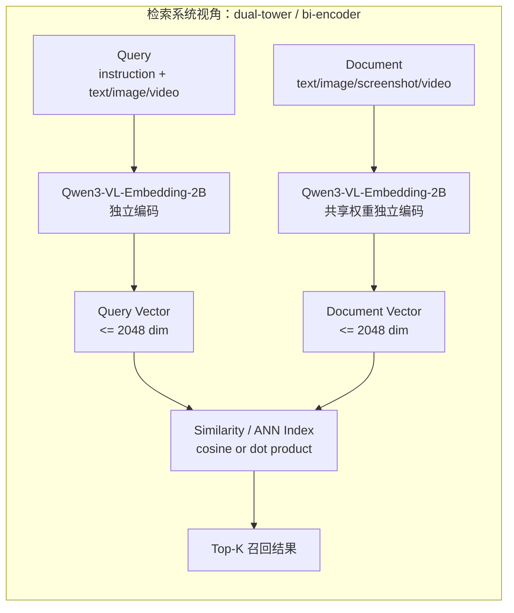

## 2. 模型架构与向量生成

### 2.1 模型内部的向量生成路径

从模型内部看，它仍然继承 Qwen3-VL 的多模态处理链路：文本会被分词，图片/视频会被视觉编码器切成视觉 token，随后这些 token 被组织成统一的多模态序列送入 Qwen3-VL 主干。官方架构说明中，Embedding 模型会取基础模型最后一层中 `[EOS]` token 对应的 hidden state，作为最终语义表示。

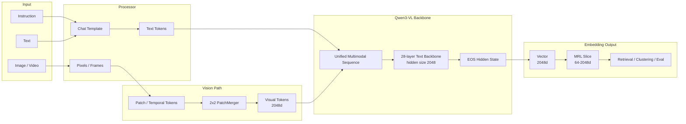

后训练时更应关注三个接口：输入样本如何组织成 `instruction + multimodal object`，输出向量如何参与相似度计算，以及训练 loss 如何把正例拉近、负例推远。

### 2.2 配置级结构拆解

HF `config.json` 显示，`Qwen3-VL-Embedding-2B` 的 `architectures` 字段仍是 `Qwen3VLForConditionalGeneration`。Embedding 能力是在 Qwen3-VL 多模态主干上增加“取语义向量”的使用方式，而不是把模型变成传统 CNN/CLIP 式小双塔。

| 模块 | 关键配置 | 含义 |
|---|---|---|
| Vision Encoder | `depth=24`、`hidden_size=1024`、`num_heads=16`、`intermediate_size=4096` | 图片/视频 patch token 的视觉表征提取 |
| Vision Patch | `patch_size=16`、`temporal_patch_size=2`、`spatial_merge_size=2` | 图像按 16x16 patch 切分；视频按 2 帧时间块处理；空间上用 learned PatchMerger 做 2x2 token 合并 |
| Vision Output | `out_hidden_size=2048` | 视觉侧输出会投到语言主干的 hidden size |
| Deepstack Indexes | `[5, 11, 17]` | 配置中暴露的多层视觉特征索引；学习时可理解为视觉信息来自不同深度 |
| Text Backbone | `num_hidden_layers=28`、`hidden_size=2048`、`intermediate_size=6144` | Qwen3-VL 文本/融合主干，最终 `[EOS]` hidden state 也在这个维度 |
| Attention | `num_attention_heads=16`、`num_key_value_heads=8`、`head_dim=128` | 使用 GQA 风格配置，查询头数多于 KV 头数 |
| Positional Encoding | `mrope_section=[24,20,20]`、`rope_theta=5000000` | 多模态位置编码配置，用于文本、空间、时间等维度的位置建模 |
| Token IDs | `image_token_id=151655`、`video_token_id=151656`、`eos_token_id=151645` | 多模态占位 token 与最终 pooling 位置相关 |

### 2.3 更细的内部结构图

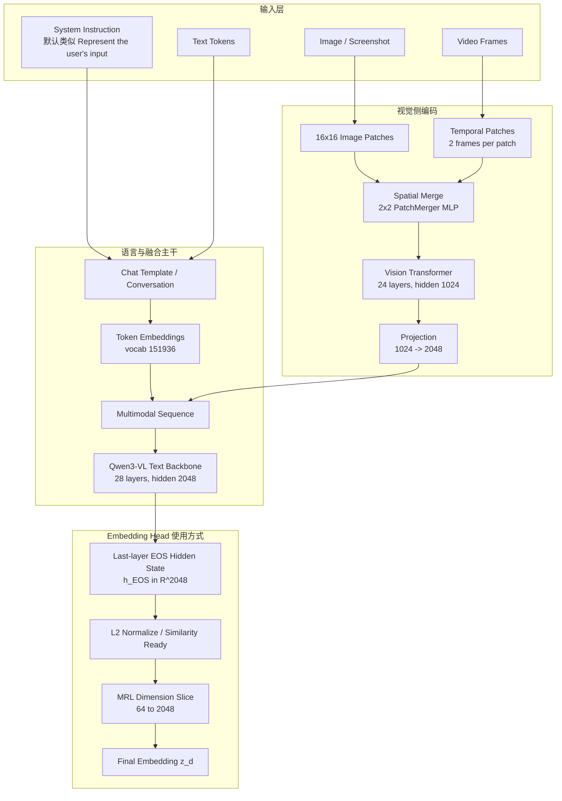

### 2.4 多模态 token 流

不同模态最后都会变成同一个序列里的 token。文本 token 提供语义约束，视觉 token 提供图像/视频内容，system instruction 决定“这次表征要服务什么任务”。

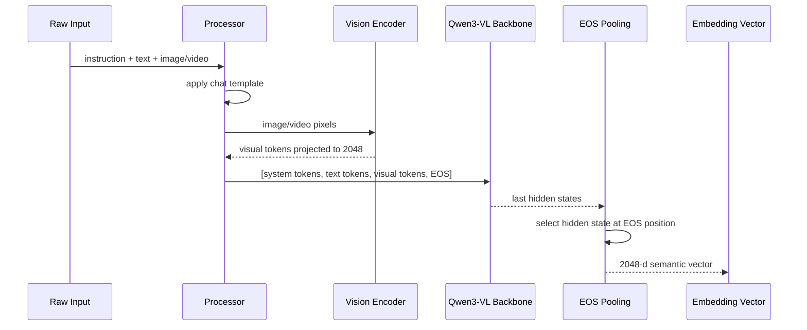

### 2.5 空间合并机制：不是 max/avg pooling

`spatial_merge_size=2` 的作用和 CNN 里的 pooling 很像：它会降低空间网格分辨率，从而减少送入语言主干的视觉 token 数。但在 Qwen3-VL 的实现里，它不是 max pooling，也不是 average pooling，而是一个可学习的 `Qwen3VLVisionPatchMerger` MLP。

以图像 patch token 为例。`patch_size=16` 会先把图像切成 16x16 patch，每个 patch 得到一个视觉 token。随后 `spatial_merge_size=2` 会把空间相邻的 2×2 个 token 组成一个 group：

```text
合并前的 patch token 网格：

x00  x01  x02  x03
x10  x11  x12  x13
x20  x21  x22  x23
x30  x31  x32  x33

按 2×2 分组：

[x00 x01] -> y00     [x02 x03] -> y01
[x10 x11]            [x12 x13]

[x20 x21] -> y10     [x22 x23] -> y11
[x30 x31]            [x32 x33]
```

若视觉编码器单个 patch token 的维度为 1024，则一个 2×2 group 会先被拼接成 4096 维向量：

$$
u_{t,h,w}
=
\operatorname{concat}
\left(
x_{t,2h,2w},
x_{t,2h,2w+1},
x_{t,2h+1,2w},
x_{t,2h+1,2w+1}
\right)
\in \mathbb{R}^{4 \cdot 1024}
$$

`PatchMerger` 随后用 LayerNorm 和两层 MLP 生成一个新的视觉 token：

$$
y_{t,h,w}
=
W_2 \,
\operatorname{GELU}
\left(
W_1 \,
\operatorname{LN}(u_{t,h,w})
\right)
\in \mathbb{R}^{2048}
$$

其中 2048 来自 `out_hidden_size=2048`，也就是语言主干的 hidden size。这个过程的重点是：4 个局部 token 不是被取最大值或平均值，而是被拼接后交给可学习的 MLP 自行决定如何融合。

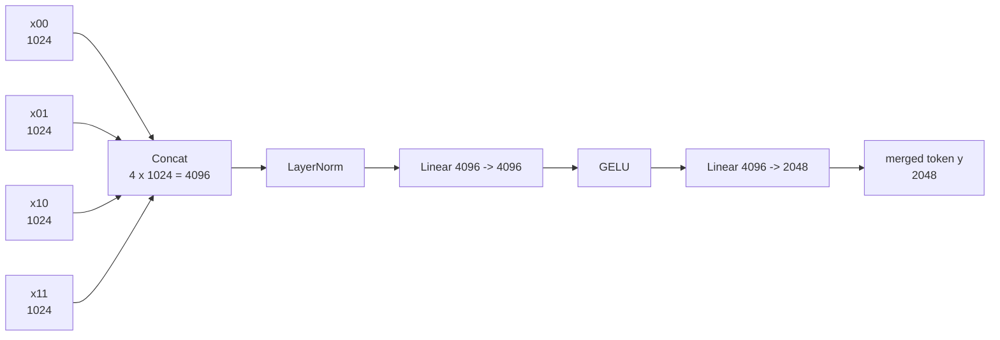

### 2.6 PatchMerger 的参数共享方式

PatchMerger 的参数共享方式更接近卷积核的“跨空间位置共享”，而不是“全模型共享”或“每层共享”。

- 同一个 PatchMerger 会应用到所有 2×2 空间 group 上，因此不同空间位置共享同一套 MLP 权重。
- 同一个 PatchMerger 会应用到 batch 内所有图片/视频样本上，因此不同样本也共享同一套 MLP 权重。
- PatchMerger 不和 Transformer block 里的 MLP 共享参数。
- PatchMerger 不是每个视觉层都有一个；主视觉塔末端有一个 `self.merger`。
- `Qwen/Qwen3-VL-Embedding-2B` 的 `deepstack_visual_indexes=[5,11,17]` 对应额外的 `deepstack_merger_list`。这些 deepstack merger 是独立模块，彼此不共享参数，也不和最终 `self.merger` 共享参数。

因此更准确的结构是：

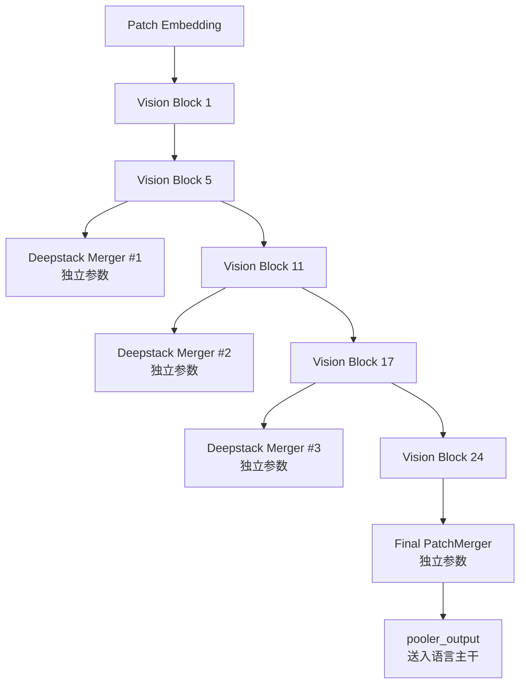

单个 merger 内部的共享关系可写为：

$$
y_{t,h,w}
=
\operatorname{MLP}_{\text{merger}}
\left(
\operatorname{concat}
(x_{t,2h,2w}, x_{t,2h,2w+1}, x_{t,2h+1,2w}, x_{t,2h+1,2w+1})
\right)
$$

同一个 $\operatorname{MLP}_{\text{merger}}$ 会被用于所有 $(t,h,w)$ 位置；不同 merger 实例则有各自独立的 $\operatorname{MLP}$ 参数。

### 2.7 视觉 token 数估算

设输入图片经过动态缩放后的高宽为 $H \times W$，patch size 为 $P=16$，空间合并大小为 $M=2$。这里的 $M=2$ 指 2x2 patch token group 会被 PatchMerger MLP 合并成 1 个 token。忽略 padding、动态分辨率约束和特殊 token 时，图片视觉 token 数可粗略估算为：

$$
N_{\text{image}}
\approx
\frac{\lceil H / P \rceil \cdot \lceil W / P \rceil}{M^2}
=
\frac{\lceil H / 16 \rceil \cdot \lceil W / 16 \rceil}{4}
$$

视频还会引入时间维。设采样后帧数为 $T$，`temporal_patch_size=2`，则粗略 token 数为：

$$
N_{\text{video}}
\approx
\left\lceil \frac{T}{2} \right\rceil
\cdot
\frac{\lceil H / 16 \rceil \cdot \lceil W / 16 \rceil}{4}
$$

这两个公式只用于估算显存和上下文压力。真实 token 数还会受到 processor 的动态 resize、min/max pixels、视频采样策略、padding 和特殊占位 token 影响。

### 2.8 EOS Pooling 与向量归一化

设模型最后一层输出为：

$$
H^{(L)} = [h_1^{(L)}, h_2^{(L)}, \ldots, h_n^{(L)}], \quad h_i^{(L)} \in \mathbb{R}^{2048}
$$

如果 $t_{\text{eos}}$ 是 `[EOS]` token 的位置，则 embedding 原始向量为：

$$
e = h_{t_{\text{eos}}}^{(L)} \in \mathbb{R}^{2048}
$$

检索系统通常使用 L2 归一化后的向量：

$$
z = \frac{e}{\lVert e \rVert_2}
$$

当 query 向量和 document 向量都已经归一化时，点积就等价于 cosine similarity：

$$
\operatorname{sim}(q, d)
=
z_q^\top z_d
=
\cos(z_q, z_d)
$$

官方示例直接使用矩阵乘法计算相似度：

$$
S = Z_Q Z_D^\top
$$

其中 $Z_Q \in \mathbb{R}^{B_q \times d}$，$Z_D \in \mathbb{R}^{B_d \times d}$，$S_{ij}$ 表示第 $i$ 个 query 和第 $j$ 个 document 的相似度。

### 2.9 MRL 维度裁剪

`Qwen3-VL-Embedding-2B` 支持 64 到 2048 的自定义输出维度，这来自 Matryoshka Representation Learning，简称 MRL。直觉上，它不是简单地“训练一个 2048 维向量，然后推理时随便截断”，而是在训练阶段就要求不同长度的前缀子向量都能完成检索任务。这样完整向量像俄罗斯套娃一样嵌套：前 64 维先承载最核心的语义，前 128 / 256 / 512 维逐步补充更细的信息，2048 维保留最完整的表达能力。

若完整 embedding 原始向量为：

$$
e \in \mathbb{R}^{2048}
$$

普通 embedding 训练通常只对完整维度做一次归一化和一次对比学习 loss：

$$
z = \frac{e}{\lVert e \rVert_2}
$$

MRL 则会预先选一组嵌套维度，例如：

$$
\mathcal{D}_{\text{MRL}} = \{64, 128, 256, 512, 1024, 2048\}
$$

对每个目标维度 $d \in \mathcal{D}_{\text{MRL}}$，都取前 $d$ 维并单独重新归一化：

$$
e_{[1:d]} = e_{1:d}
$$

$$
\tilde{z}_d = \frac{e_{[1:d]}}{\lVert e_{[1:d]} \rVert_2}
$$

注意这里必须重新归一化，而不是直接截取已经归一化过的 2048 维向量。因为截断后子向量的 L2 norm 通常不再等于 1；如果不重新归一化，不同维度下的点积分数尺度会漂移，Recall@K 和阈值判断都会变得不可比。

在训练阶段，同一个 batch 只需要前向得到一次完整向量，然后在 loss 里对多个前缀维度分别计算相似度矩阵。设一个 batch 中 query 和 document 的完整向量分别为：

$$
E_Q, E_D \in \mathbb{R}^{B \times 2048}
$$

对某个维度 $d$，取前缀并归一化：

$$
\tilde{Z}_{Q,d}
=
\operatorname{norm}(E_Q[:, 1:d])
$$

$$
\tilde{Z}_{D,d}
=
\operatorname{norm}(E_D[:, 1:d])
$$

然后像普通 InfoNCE 一样计算 batch 内相似度：

$$
S_d
=
\tilde{Z}_{Q,d}\tilde{Z}_{D,d}^{\top}
$$

若第 $i$ 个 query 的正例是第 $i$ 个 document，那么这个维度上的 loss 可以写成：

$$
\mathcal{L}_d
=
-
\frac{1}{B}
\sum_{i=1}^{B}
\log
\frac{
\exp(S_{d,ii} / \tau)
}{
\sum_{j=1}^{B}
\exp(S_{d,ij} / \tau)
}
$$

MRL 的总 loss 则是多个维度 loss 的加权和：

$$
\mathcal{L}_{\text{MRL}}
=
\sum_{d \in \mathcal{D}_{\text{MRL}}}
w_d \mathcal{L}_d
$$

最简单做法是所有 $w_d$ 相等；也可以给小维度更高权重，让低成本向量更强，或者给业务最终使用的维度更高权重。比如线上主要用 512 维，就可以让 $512$ 附近的 loss 权重更大。无论权重怎么设，核心都是：每个前缀维度都必须把正例排到负例前面。

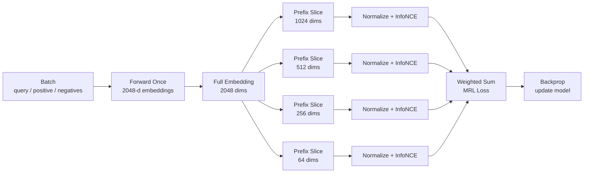

这个训练方式会带来一个很重要的梯度分布：前 64 维会参与所有包含它的前缀 loss，前 128 维会参与 $128/256/512/1024/2048$ 等维度的 loss，而最后面的维度只会参与大维度 loss。因此越靠前的维度越频繁地被要求解决检索任务，模型会被迫把最通用、最稳定的语义压缩到前面，把更细粒度的信息放到后面的维度里。MRL 能在推理时裁剪维度，根本原因就在这里。

如果训练数据里有 hard negatives，MRL 的处理方式也不特殊：每个维度 $d$ 下都用同一批 positive / negative 计算一遍对比学习或 ranking loss。例如对一个 query $q_i$、正例 $p_i$、hard negative $n_{i,k}$，会分别在 64、128、256、512、1024、2048 维空间里要求：

$$
\operatorname{sim}_d(q_i, p_i)
>
\operatorname{sim}_d(q_i, n_{i,k})
$$

其中：

$$
\operatorname{sim}_d(q, x)
=
\tilde{z}_{q,d}^{\top}\tilde{z}_{x,d}
$$

也就是说，hard negative 不只是帮助完整 2048 维学会区分细粒度语义，也会约束 64 / 128 / 256 维这些低成本向量不要只学到粗糙主题匹配。

推理阶段就简单很多：选择目标维度 $d \in [64, 2048]$ 后，取前 $d$ 维并重新归一化即可：

$$
\tilde{z}_d = \frac{e_{[1:d]}}{\lVert e_{[1:d]} \rVert_2}
$$

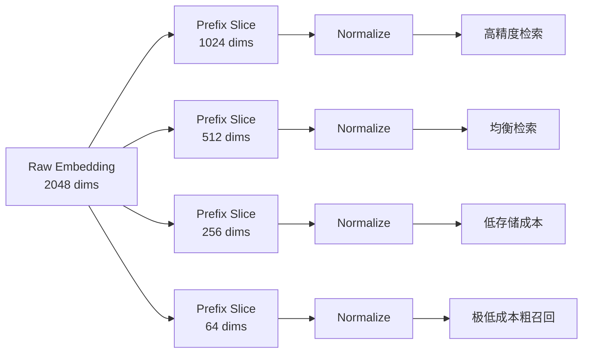

工程上要注意三点。第一，query 和 document 必须使用同一个维度；不能 query 用 512 维，document 库却用 2048 维。第二，建库维度、评测维度和线上维度必须一致；如果线上想从 1024 维切到 512 维，通常需要重建或至少重写向量库。第三，不要只看 2048 维指标，应该分别评测 64 / 128 / 256 / 512 / 1024 / 2048 维下的 Recall@K、MRR、nDCG、延迟和存储成本，选业务收益最高的点。

维度越小，向量库占用、网络传输和相似度计算成本越低；维度越大，通常保留的信息越充分。MRL 的价值是让这些维度形成可用的质量-成本曲线，而不是只能在“完整精度”和“不可用截断”之间二选一。

## 3. 后训练目标：InfoNCE 与对比学习

后训练时，最常见目标不是 next-token SFT，而是让 query 与 positive document 的相似度高于 negative document。InfoNCE 是这类 embedding 训练里最常见的目标之一，可以把它理解成“在一组候选文档里，把正例分类出来”的 softmax 交叉熵。模型不会直接生成答案，而是为 query 和每个 candidate 计算相似度；正例相似度越高、负例相似度越低，loss 越小。

对一个 query $q_i$、正例 $p_i$、负例集合 $\mathcal{N}_i$，候选集合可以写成：

$$
\mathcal{C}_i = \{p_i\} \cup \mathcal{N}_i
$$

模型先把所有候选的相似度变成 logits：

$$
\ell(q_i, c) = \frac{\operatorname{sim}(q_i, c)}{\tau}, \quad c \in \mathcal{C}_i
$$

然后通过 softmax 让正例在候选集合中获得最高概率：

$$
P(p_i \mid q_i, \mathcal{C}_i)
=
\frac{
\exp(\operatorname{sim}(q_i, p_i) / \tau)
}{
\sum_{c \in \mathcal{C}_i}
\exp(\operatorname{sim}(q_i, c) / \tau)
}
$$

因此 InfoNCE 本质上是在最小化正例的负对数概率：

$$
\mathcal{L}_i
=
-
\log
\frac{
\exp(\operatorname{sim}(q_i, p_i) / \tau)
}{
\exp(\operatorname{sim}(q_i, p_i) / \tau)
+
\sum_{n \in \mathcal{N}_i}
\exp(\operatorname{sim}(q_i, n) / \tau)
}
$$

其中 $\tau$ 是 temperature，控制分布的 sharpness。$\tau$ 越小，softmax 越尖锐，模型会更强烈地惩罚“和正例分数接近的负例”；$\tau$ 越大，分布越平滑，训练信号更温和。实际训练中，temperature 太小容易让 hard negative 或 false negative 造成不稳定，temperature 太大又可能让正负样本区分不够强。

InfoNCE 的一个关键工程优势是可以使用 batch 内负例。假设一个 batch 里有 $B$ 个 query-positive pair：

$$
(q_1,p_1), (q_2,p_2), \ldots, (q_B,p_B)
$$

对第 $i$ 个 query 来说，$p_i$ 是正例，而同一 batch 中的其他 $p_j$ 可以作为负例：

$$
\mathcal{N}_i^{\text{batch}} = \{p_j \mid j \ne i\}
$$

这样一个 batch 只需要显式提供 $B$ 个正例，就能形成 $B \times B$ 的相似度矩阵，产生大量对比信号。batch 内负例版本会把同一个 batch 中其他样本的 positive 也当作负例：

$$
\mathcal{L}
=
-
\frac{1}{B}
\sum_{i=1}^{B}
\log
\frac{
\exp(S_{ii}/\tau)
}{
\sum_{j=1}^{B}
\exp(S_{ij}/\tau)
}
$$

这个矩阵形式里，$S_{ii}$ 是第 $i$ 个 query 与对应正例的相似度，$S_{ij}$ 是第 $i$ 个 query 与第 $j$ 个 document 的相似度。训练目标会把对角线元素推高，把非对角线元素相对压低。

```text
相似度矩阵 S:

          p1      p2      p3
q1      S11*    S12     S13
q2      S21     S22*    S23
q3      S31     S32     S33*

* 表示正例位置。InfoNCE 希望每一行的正例列最大。
```

hard negative 会进一步增强这个目标。随机负例通常太容易区分，loss 很快变小，但模型未必学到细粒度判别；hard negative 则和 query 在文本、视觉或业务语义上很相似，却不是正确答案，能迫使模型学习更精细的边界。不过 hard negative 也更容易混入 false negative，所以构造数据时需要确认“难负例确实是负例”。

对多模态 embedding，InfoNCE 的正负样本可以跨模态组织。例如 image query 的 positive 可以是文本描述，text query 的 positive 可以是图片，screenshot query 的 positive 可以是帮助文档。只要这些输入最终都被编码成同一向量空间，公式本身并不关心模态类型。

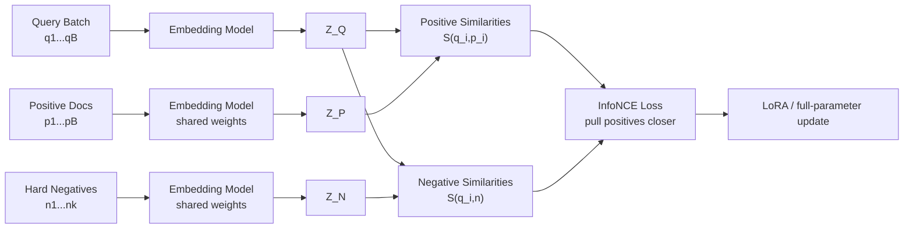

这个目标和 LLM DPO 的直觉很接近：正例相当于 chosen，负例相当于 rejected；区别在于 embedding 训练直接优化向量空间里的相对距离，而不是优化生成 token 的偏好概率。

## 4. 后训练路线总览

学习起点不应是“怎么对 VLM 做 SFT/RL”这个抽象问题。更稳的路线是：

1. 先把它当成一个 **多模态检索系统**：Embedding 负责召回，Reranker 负责精排。
2. 再把训练任务拆成两类：
   - `Embedding`：学习向量空间，常见目标是 InfoNCE / contrastive / cosine similarity。
   - `Reranker`：学习 query-document 相关性，常见目标是 pointwise / listwise ranking。
3. 最后才考虑 RL。对 embedding/reranker 来说，RL 通常不是第一刀；绝大部分业务收益来自数据构造、hard negative mining、reranker 监督训练、reranker-to-embedding distillation。

LLM SFT/DPO 背景很好迁移到检索后训练：  
`DPO` 里的 chosen/rejected，到了检索模型里就是 `query + positive_doc + negative_doc`；  
`SFT` 里的 instruction following，到了检索模型里就是 `instruction-aware retrieval`。

## 5. 检索与训练心智模型

### 5.1 Embedding 模型：双塔/bi-encoder

Qwen3-VL-Embedding 接收文本、图片、截图、视频或混合模态输入，把每个输入独立编码成一个向量。

推理时：

1. 离线把文档、图片、视频片段等 corpus 编成向量。
2. 在线把 query 编成向量。
3. 用 cosine / dot product / ANN index 找 top-k。

训练时，核心关注点不是“生成正确答案”，而是：

- query 和正例是否更近；
- query 和负例是否更远；
- hard negative 是否能被拉开；
- 不同模态是否落在同一个可检索的语义空间里。

这里的 `content` 不是单纯的图片描述，而是 `多模态占位符 + 检索任务 instruction`。`<image>` 表示把 `images` 字段里的图片插入到当前位置；后面的文字说明这张图片要按什么目标编码，即instruction-aware embedding。比如同一张图片，用“找同款商品”“找相同 logo”“找视觉风格相似图片”会强调不同的相似性。训练、评测和线上推理时，这类 instruction 应尽量保持一致。

典型训练样本（图搜文 / image-to-text）：

```json
{
   "messages":[
        {
            "role":"user", 
            "content":"<image> 找到和这张商品图同款的商品"
            }
        ],
    "images":["/data/query/item_001.jpg"],
    "positive_messages":[
        [{"role":"user","content":"红色连帽卫衣，胸前白色 logo"}]
    ],
    "negative_messages":[
        [{"role":"user","content":"蓝色牛仔外套"}],
        [{"role":"user","content":"红色短袖 T 恤"}]
    ]
}
```

### 5.2 Reranker 模型：单塔/cross-encoder

Qwen3-VL-Reranker 接收 `(Query, Document)` 对，并输出相关性分数。它比 embedding 慢，但能在 query 和 document 之间做更细粒度的 cross-attention。

典型线上链路：

```text
query
  -> Qwen3-VL-Embedding 召回 top 50/100/200
  -> Qwen3-VL-Reranker 精排
  -> 返回 top 5/10
```

典型样本：

```json
{
    "messages":[
        {"role":"user", "content":"<image> 找和这张截图表达同一意思的页面"}
    ],
    "images":["/data/query/screen_001.png"],
    "positive_messages":[[{"role":"assistant", "content":"<image> 同一功能入口的新版 UI 截图"}]],
    "positive_images":[["/data/doc/screen_pos.png"]],
    "negative_messages":[[
        {"role":"assistant", "content":"<image> 视觉相似但功能不同的 UI 截图"}
    ]],
    "negative_images":[["/data/doc/screen_hard_neg.png"]]
}
```

### 5.3 和 LLM SFT / DPO 的对应关系

| LLM 训练概念 | 在 embedding/reranker 里的对应物 |
|---|---|
| prompt -> answer | query -> relevant document |
| SFT loss | contrastive / ranking / BCE / CE |
| chosen / rejected | positive document / negative document |
| reward model | reranker |
| DPO 偏好对 | pairwise/listwise ranking data |
| instruction tuning | query/document 前加 task instruction |
| eval loss | Recall@K、MRR、nDCG、MAP、AUC、业务点击/转化指标 |

## 6. 官方模型和训练入口

### 6.1 推荐训练框架

优先看 `ms-swift`，原因很现实：

- 官方文档已经支持 `qwen3-vl-embedding` 和 `qwen3-vl-reranker`。
- 同一套框架覆盖 LLM SFT、DPO、GRPO、Embedding、Reranker。
- 数据格式对多模态字段比较友好：`messages`、`images`、`videos`、`positive_messages`、`negative_messages` 等。
- 有现成 Qwen3-VL-Embedding / Qwen3-VL-Reranker 示例脚本。

第二选择是 `sentence-transformers`：

- 学 embedding loss、reranker/cross-encoder 概念很清楚。
- 文本检索训练生态成熟。
- 但对 Qwen3-VL 这种多模态大模型的工程适配，不如 ms-swift 直接。

## 7. 推荐学习顺序

### 7.1 第 1 阶段：IR/RAG 基本概念

目标：能清楚解释为什么 embedding 和 reranker 都需要，以及它们各自优化什么。必须掌握的概念不多，但每个概念都直接决定后训练该怎么做。

| 概念 | 简短定义 | 对 Qwen3-VL-Embedding 后训练的意义 |
|---|---|---|
| `bi-encoder` / 双塔 | query 和 document 分别独立编码成向量，再计算相似度 | `Qwen3-VL-Embedding-2B` 的主要使用方式；优点是可提前离线编码 corpus，适合大规模召回 |
| `cross-encoder` / 单塔 | query 和 document 拼在一起进入模型，模型直接判断相关性 | reranker 的典型方式；精度高但慢，不能给全量 corpus 逐个打分 |
| `top-k recall` | 从全量 corpus 中先召回最可能相关的 k 个候选 | embedding 训练首先要保证“正确答案能进候选池” |
| `reranking` | 对召回出的少量候选重新排序 | reranker 训练解决“答案在候选池里但排得不够靠前”的问题 |
| `positive` | 与 query 真正相关的文档、图片、视频片段或图文 chunk | 训练中要被拉近；评测中作为命中目标 |
| `negative` | 与 query 不相关的候选 | 训练中要被推远；太简单的 negative 价值有限 |
| `hard negative` | 表面很像、模型容易误召回、但实际不相关的候选 | 后训练最重要的数据资产之一，能提升细粒度判别能力 |
| `false negative` | 被标成负例但其实相关的候选 | 对 contrastive training 伤害很大，会强迫模型把正确语义推远 |
| `ANN index` | 近似最近邻索引，用较低成本在大规模向量库中找近邻 | 线上召回必备；训练评测时也常用 FAISS / Milvus / pgvector 等工具模拟真实链路 |

#### 7.1.1 单塔模型和双塔模型

`bi-encoder` 和 `cross-encoder` 的区别可以用一张图记住：

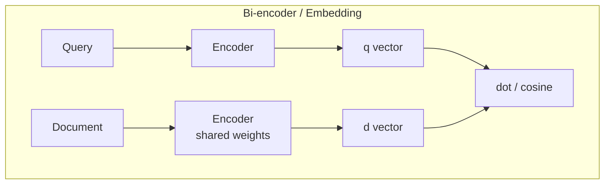

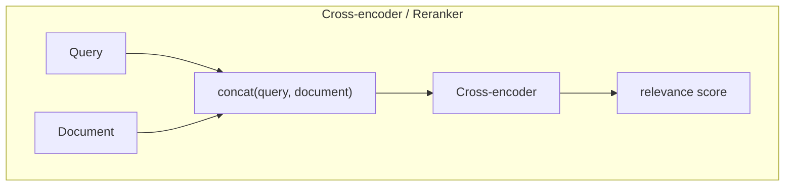

双塔的核心优势是“可缓存”。corpus 里的 document embedding 可以提前算好并写入向量库，线上只需要编码 query，再做近邻搜索。单塔的核心优势是“交互充分”。query token 和 document token 可以在模型内部做 cross-attention，因此更擅长细粒度判断，但每个 query-document pair 都要跑一次模型，成本高很多。

#### 7.1.2 常见指标

`top-k recall` 和 `reranking` 是两阶段检索系统里的两个不同目标：

```text
全量 corpus
  -> embedding / ANN 召回 top 100
  -> reranker 精排 top 100
  -> 返回 top 5 或 top 10
```

如果正例没有进入 embedding 的 top-k，reranker 再强也没有机会把它排上去。因此 embedding 训练优先优化 Recall@K；如果正例已经进入 top-k 但排名靠后，reranker 才能发挥作用。

正负样本的关系可以对应到 LLM 偏好训练：

| 检索训练 | LLM 偏好训练里的直觉 | 训练动作 |
|---|---|---|
| query | prompt | 固定检索需求 |
| positive | chosen | 与 query 拉近 |
| negative | rejected | 与 query 推远 |
| hard negative | 高迷惑度 rejected | 重点推远 |
| false negative | 错标 rejected | 必须清理或降权 |

常见指标也要从“召回”和“排序”两个角度理解。

`Recall@K` 衡量正例是否进入前 K 个候选：

$$
\operatorname{Recall@K}
=
\frac{\#\{\text{正例出现在 top K 的 query}\}}{\#\{\text{全部 query}\}}
$$

如果每个 query 只有一个正例，`Recall@10 = 0.8` 表示 80% 的 query 能在前 10 个召回结果里找到正确答案。它特别适合评估 embedding 召回模型。

`MRR` 关注第一个正确答案排在多靠前：

$$
\operatorname{MRR}
=
\frac{1}{|Q|}
\sum_{q \in Q}
\frac{1}{\operatorname{rank}_q}
$$

如果正确答案排第 1，贡献是 1；排第 5，贡献是 0.2；没有命中，贡献是 0。它对“第一个可用结果的位置”很敏感。

`nDCG@K` 更适合有多级相关性标签的排序任务。它不仅关心有没有相关结果，也关心更相关的结果是否排得更靠前：

$$
\operatorname{DCG@K}
=
\sum_{i=1}^{K}
\frac{2^{rel_i}-1}{\log_2(i+1)}
$$

$$
\operatorname{nDCG@K}
=
\frac{\operatorname{DCG@K}}{\operatorname{IDCG@K}}
$$

其中 $rel_i$ 是第 $i$ 个结果的相关性分数，`IDCG` 是理想排序下的 DCG。reranker 训练和端到端排序评测通常更关注 MRR/nDCG。

ANN index 是检索工程里绕不开的一层。精确暴力搜索要把 query 向量和所有 document 向量都算一遍相似度，corpus 很大时不可接受；ANN 牺牲一点点精确性，换来更低延迟和更高吞吐。常见选择包括：

| 工具 | 适合场景 |
|---|---|
| FAISS | 本地实验、离线评测、快速原型 |
| Milvus | 大规模向量检索服务，适合工程化部署 |
| Elasticsearch vector | 已经在用 ES 做关键词检索，想融合向量召回 |
| pgvector | 数据规模中小、希望和 PostgreSQL 业务数据放在一起 |

训练阶段不一定马上接完整向量数据库，但评测阶段最好尽早模拟真实召回链路：使用同样的向量维度、归一化方式、相似度函数、top-k 设置和过滤规则。否则训练集 loss 下降，不一定等价于线上 Recall@K 变好。

读资料时要带着一个问题：  
**embedding 训练提升的是“召回池里有没有答案”；reranker 训练提升的是“答案在候选里能不能排上去”。**

### 7.2 第 2 阶段：复现 baseline，而不是马上训练

先用现成模型跑一个团队业务的小评测集。

最低配评测集：

```text
queries.jsonl
corpus.jsonl
qrels.tsv
```

示例：

```jsonl
// queries.jsonl
{"qid":"q1","text":"找出包含红色连帽卫衣的商品图","image":"/data/query/q1.jpg","instruction":"根据图片和文本找相关商品"}
{"qid":"q2","text":"这张 UI 截图对应哪篇帮助文档","image":"/data/query/q2.png","instruction":"根据截图检索帮助文档"}
```

```jsonl
// corpus.jsonl
{"docid":"d1","text":"红色连帽卫衣，胸前白色 logo","image":"/data/corpus/d1.jpg"}
{"docid":"d2","text":"账号设置页面帮助文档","image":"/data/corpus/d2.png"}
```

```tsv
qid	docid	label
q1	d1	1
q2	d2	1
```

先记录：

- embedding only 的 Recall@1/5/10/50；
- embedding top-k + reranker 的 nDCG@10 / MRR@10；
- 按模态拆分：text->text、text->image、image->text、image->image、screenshot->doc、video->text。

这一步非常关键，因为没有 baseline，后续即使训练 loss 降了，也无法判断业务效果是否真的变好。

### 7.3 第 3 阶段：训练 Embedding，先用 InfoNCE

Embedding 后训练的主线不是普通 next-token SFT，而是 metric learning：同一个 query 的 positive 应该在向量空间里更近，negative 应该更远。

ms-swift 官方 [Embedding Training 文档](https://swift.readthedocs.io/en/latest/BestPractices/Embedding.html) 明确支持纯文本和多模态 embedding 训练，并把 `Qwen/Qwen3-VL-Embedding-2B`、`Qwen/Qwen3-VL-Embedding-8B`列入支持模型；官方 [qwen3_vl_emb.sh](https://github.com/modelscope/ms-swift/blob/main/examples/train/embedding/qwen3/qwen3_vl_emb.sh) 也直接使用 `swift sft --task_type embedding --loss_type infonce` 来训练 Qwen3-VL-Embedding。

因此第 3 阶段的默认路线应该是：

1. 先跑 `InfoNCE`：只需要 anchor-positive pair，不需要人工连续分数，也不需要 0/1 label；`negative_messages` 可先省略，由 batch 内其它样本自然构成 in-batch negatives。
2. 再加 `InfoNCE + hard negatives`：当 baseline 已经能跑通后，把召回结果里“看起来相似但其实不相关”的候选放进 `negative_messages`，让模型学习更细的边界。
3. 只有当数据天然是二分类 pair 时，再考虑 `contrastive / online_contrastive`；只有当数据带人工相似度分数时，再考虑 `cosine_similarity`。

官方文档对这些 loss 的定位也比较清楚：`infonce` 会在同一个 batch 的不同行之间计算 pairwise cosine similarities，最大化匹配行的相似度并最小化非匹配行的相似度，且不需要 label；`cosine_similarity` 更像拟合相似度分数，`contrastive / online_contrastive` 则要求 label 为 0 或 1。源码层面，`swift/loss/mapping.py` 中的 `loss_map` 把 `infonce` 映射到 `InfonceLoss`，具体实现位于 [swift/loss/embedding.py](https://github.com/modelscope/ms-swift/blob/main/swift/loss/embedding.py)。

用公式写，设第 $i$ 个样本的 anchor 向量为 $q_i$，positive 向量为 $d_i^+$，温度为 $\tau$。在 `INFONCE_USE_BATCH=True` 时，候选集合 $\mathcal{D}$ 会包含当前 batch 中其它样本的 positive，以及样本内提供的 hard negatives：

$$
\mathcal{L}_i
=
-\log
\frac{\exp(\operatorname{sim}(q_i,d_i^+) / \tau)}
{\sum_{d \in \mathcal{D}}\exp(\operatorname{sim}(q_i,d) / \tau)}
$$

ms-swift 文档还说明，embedding 模型 forward 末尾会做归一化；在归一化向量上，点积和 cosine similarity 等价。因此源码中的矩阵乘法可以理解为批量计算 cosine 相似度。

因此，一条训练样本里虽然通常只有一个 `positive_messages`，但训练时这个 positive 不是只和本条样本显式标注的 `negative_messages` 对比。在 `INFONCE_USE_BATCH=True` 时，同一个 batch 里其它样本的 positive 也会成为当前 query 的负例。比如一个 batch 里有：

```text
样本 1: q1 -> p1, negatives: n1a, n1b
样本 2: q2 -> p2, negatives: n2a
样本 3: q3 -> p3, negatives: n3a
```

对 `q1` 来说，正例是 `p1`，负例通常包括本条样本显式提供的 `n1a / n1b`，也包括 batch 内其它样本的 `p2 / p3`。训练目标可以理解为：

```text
sim(q1, p1) > sim(q1, n1a)
sim(q1, p1) > sim(q1, n1b)
sim(q1, p1) > sim(q1, p2)
sim(q1, p1) > sim(q1, p3)
```

反过来，`p1` 也会作为 `q2`、`q3` 的 batch 内负例。这就是 InfoNCE 高效的地方：即使不手工提供 `negative_messages`，一个 batch 也能自然形成大量对比信号。显式 `negative_messages` 更适合放 hard negatives，用来补充 batch 内随机负例不够难的问题。

这也带来一个风险：如果其它样本的 positive 其实也和当前 query 相关，它就会变成 false negative，训练会错误地把相关语义推远。因此构造数据时要尽量避免同一个 query family 或多个等价正例混进同一个 batch；hard negative mining 后也要清理疑似相关样本。必要时可以关注 `INFONCE_MASK_FAKE_NEGATIVE` 这类机制，用来屏蔽相似度异常高、可能并非真正负例的样本。

ms-swift 的 InfoNCE JSONL 以 `messages` 作为 anchor，以 `positive_messages` 作为正例。多模态样本用 `<image>`、`<video>`、`<audio>` 占位符，并用对应的 `images`、`videos`、`audios` 字段提供路径或 URL。官方文档中特别强调：`positive_messages` 的外层长度当前必须为 1；`positive_images`、`negative_images` 是 list-of-list，并分别与 `positive_messages`、`negative_messages` 外层逐项对齐。

```jsonl
{
    "messages":[{"role":"user","content":"sentence1"}],
    "positive_messages":[[{"role":"user","content":"sentence2"}]]
}
{
    "messages":[
        {"role":"user","content":"<image>sentence1"}
    ],
    "images":["/data/query.jpg"],
    "positive_messages":[[
        {"role":"user","content":"<image>sentence2"}
    ]],
    "positive_images":[["/data/positive.jpg"]],
    "negative_messages":[
        [{"role":"user","content":"<image><image>sentence3"}],
        [{"role":"user","content":"<image>sentence4"}]
    ],
    "negative_images":[
        ["/data/negative_a.jpg","/data/negative_b.jpg"],
        ["/data/negative_c.jpg"]
    ]
}
```

训练脚本不必从零写。下面的命令是把官方 Qwen3-VL-Embedding 脚本的 `8B` 模型名替换成本文学习对象 `2B`，其余关键结构保持官方风格：

```bash
CUDA_VISIBLE_DEVICES=0,1 \
INFONCE_TEMPERATURE=0.1 \
NPROC_PER_NODE=2 \
swift sft \
  --model Qwen/Qwen3-VL-Embedding-2B \
  --task_type embedding \
  --tuner_type lora \
  --lora_rank 8 \
  --lora_alpha 32 \
  --target_modules all-linear \
  --learning_rate 5e-5 \
  --dataset train_embedding.jsonl \
  --torch_dtype bfloat16 \
  --attn_impl flash_attn \
  --padding_free true \
  --max_length 8192 \
  --per_device_train_batch_size 8 \
  --per_device_eval_batch_size 8 \
  --gradient_accumulation_steps 1 \
  --num_train_epochs 1 \
  --eval_strategy steps \
  --save_steps 50 \
  --eval_steps 50 \
  --logging_steps 5 \
  --warmup_ratio 0.05 \
  --loss_type infonce \
  --dataloader_drop_last true \
  --deepspeed zero2
```

关键参数和官方依据：

| 参数 / 环境变量 | 含义 | 实操建议 |
|---|---|---|
| `--task_type embedding` | 官方文档说明可用它把模型按 embedding 任务训练，模型 forward 需要返回 `last_hidden_state`。 | Qwen3-VL-Embedding 本身已是支持模型，仍按官方脚本显式写出。 |
| `--loss_type infonce` | 使用 `InfonceLoss`。官方文档说明它不需要 label，通过 batch 内相似度矩阵做对比学习。 | 第一次训练优先使用，数据构造成 anchor-positive 即可。 |
| `--tuner_type lora` | 官方 Qwen3-VL 示例采用 LoRA。 | 初学和业务验证阶段先 LoRA，确认有效后再考虑更重的训练。 |
| `--target_modules all-linear` | 官方 Qwen3/Qwen3-VL embedding 脚本使用该设置。 | 表示 LoRA 注入线性层，属于通用稳妥起点。 |
| `--dataloader_drop_last true` | 官方 Qwen3/Qwen3-VL embedding 脚本都保留该参数；`qwen3_emb.sh` 注释说明不 drop last 时 eval gather 可能报错。 | 多卡训练和评测时建议照官方示例保留。 |
| `INFONCE_TEMPERATURE` | 温度参数；官方文档默认值为 `0.1`，官方脚本也显式设置 `0.1`。 | 初始不必调，等 hard negative 引入后再网格搜索。 |
| `INFONCE_USE_BATCH` | 默认 `True`，表示使用 batch 内其它样本作为 in-batch negatives。 | 没有 `negative_messages` 时也能训练；有效 batch 越大，负例越多。 |
| `INFONCE_HARD_NEGATIVES` | 控制每个样本保留多少 hard negatives。未设置时会使用全部 `negative_messages`；长度不一致时会走 for-loop，速度较慢。 | hard negative 数量尽量做成固定值，或显式设置该变量，让训练更稳定也更快。 |
| `INFONCE_MASK_FAKE_NEGATIVE` | 官方文档说明可屏蔽疑似 false negative；相似度超过 `positive_similarity + INFONCE_FAKE_NEG_MARGIN` 的负例会被置为 `-inf`。 | 当 hard negatives 来自线上召回、可能混入真实相关样本时再打开。 |
| `INFONCE_INCLUDE_QQ` / `INFONCE_INCLUDE_DD` | 官方文档说明可把 query-query、doc-doc 相似度块加入分母，源码注释称其用于对齐 Qwen3-Embedding denominator。 | 初期保持默认 `False`；复现实验稳定后再作为增强项。 |

训练时不只看 loss。ms-swift 官方文档列出的 InfoNCE eval 指标包括 `mean_neg`、`mean_pos`、`margin`：`mean_pos` 应该逐步高于 `mean_neg`，`margin = positive - max hard negative` 越健康，检索边界通常越清楚。最终仍要回到第 7.2 节的固定评测集，看 Recall@K、MRR、nDCG 是否提升。

这一阶段的最小闭环是：先用 500-5000 条高置信 anchor-positive 样本跑通 LoRA；确认训练、保存、推理、评测链路都能复现；然后用 baseline embedding 召回 top-k，人工或规则过滤出 hard negatives，补入 `negative_messages`；最后固定同一份评测集比较 baseline、InfoNCE、InfoNCE + hard negatives 三组结果。

### 7.4 第 4 阶段：训练 Reranker，先 pointwise，再 listwise

Reranker 更像 LLM 训练中的 reward model / preference model。

两条路线：

- `pointwise_reranker`：每个 `(query, doc)` 独立判断相关/不相关，简单稳。
- `listwise_reranker`：一个 query 对多个候选排序，更贴近真实检索。

ms-swift 的 reranker 数据格式大致是：

```json
{
    "messages":[
        {"role":"user","content":"query"}
    ],
    "positive_messages":[
        [{"role":"assistant","content":"relevant_doc1"}]
    ],
    "negative_messages":[
        [{"role":"assistant","content":"irrelevant_doc1"}],
        [{"role":"assistant","content":"irrelevant_doc2"}]
    ]
}
```

多模态格式：

```json
{
    "messages":[{"role":"user","content":"<image>query"}],
    "images":["/some/query.jpg"],
    "positive_messages":[
        [{"role":"assistant","content":"<image>relevant_doc"}]
    ],
    "positive_images":[["/some/pos.jpg"]],
    "negative_messages":[
        [{"role":"assistant","content":"<image>irrelevant_doc"}]
    ],
    "negative_images":[["/some/neg.jpg"]]}
```

训练脚本同样先改官方示例：

```bash
swift sft \
  --model Qwen/Qwen3-VL-Reranker-8B \
  --task_type generative_reranker \
  --loss_type pointwise_reranker \
  --tuner_type lora \
  --dataset train_reranker.jsonl \
  --val_dataset val_reranker.jsonl
```

关键点：

- Reranker 的 batch size 通常比 embedding 小很多，因为它要把 query 和 document 一起送进模型。
- hard negatives 对 reranker 特别重要，否则模型只会分“明显相关”和“明显无关”。
- 评估一定要在 embedding 召回出来的 top-k 上评估，不要只评估随机负例。

### 7.5 第 5 阶段：做 hard negative mining

这一步通常比调超参更值钱。

一个实用闭环：

1. 用当前 embedding 模型对 corpus 建索引。
2. 对每个 query 检索 top 50/100。
3. 去掉已知 positive。
4. 让人工、规则、强 reranker 或 GPT/VLM teacher 判断哪些是 hard negative。
5. 把这些 hard negative 加回 embedding/reranker 训练集。
6. 重新训练，重新评测。

hard negative 的质量分层：

| 类型 | 例子 | 价值 |
|---|---|---:|
| 随机负例 | 完全无关图片/文本 | 低 |
| BM25/向量近邻负例 | 关键词或视觉相似但不相关 | 高 |
| 业务高频误召回 | 线上经常排错的候选 | 很高 |
| 同类细粒度负例 | 同品牌不同 SKU、同页面不同功能 | 最高 |

### 7.6 第 6 阶段：把 Reranker 蒸馏回 Embedding

如果 reranker 很强，但线上不能对太多候选精排，可以做 distillation：

1. 用 embedding 召回 top-k。
2. 用强 reranker 给 `(query, doc)` 打分。
3. 用 reranker score 生成软标签或正负样本。
4. 再训练 embedding，让 embedding 的相似度更接近 reranker 的排序。

这相当于让便宜的召回模型吸收昂贵 reranker 的判断。

常见目标：

- cosine similarity regression；
- pairwise ranking；
- listwise distillation；
- teacher top positive + hard negative 的 InfoNCE。

## 8. RL 应该怎么理解

当需求被表述为“SFT、RL 训练”时，建议先把概念对齐：

> 对 embedding/reranker 来说，绝大多数后训练不是传统 LLM SFT，也不是直接 PPO/GRPO 起手，而是 supervised ranking / contrastive learning。RL 只有在目标变成不可微、链路级、线上反馈型指标时才更自然。

### 8.1 哪些东西像 RL，但其实先不用 RL

这些先用监督训练解决：

- query-doc 相关/不相关；
- chosen/rejected 文档偏好；
- click / purchase / dwell time 转换成 relevance label；
- reranker 分数蒸馏；
- hard negative 对比学习。

### 8.2 什么时候才考虑 RL

考虑 RL 的场景：

- 目标是完整检索链路指标，比如 `Recall@50 + nDCG@10 + latency penalty`。
- 模型要学会选择工具、改写 query、选择 instruction、选择 crop/video frame，而不只是输出向量或 yes/no 分数。
- 有在线日志或模拟环境，可以定义 reward。
- 优化目标是业务反馈，而不是静态 qrels。

可行方向：

| 方向 | 训练对象 | reward |
|---|---|---|
| Query rewrite RL | 生成 query 改写的 LLM/VLM | 改写后检索 nDCG/Recall |
| Reranker RL/RLAIF | generative reranker | positive 排名前移、negative 后移 |
| Retrieval agent RL | 会选择检索策略的 agent | 最终答案质量、召回质量、延迟成本 |
| Instruction optimization | 给 embedding/reranker 的 task instruction | 验证集 ranking 指标 |

但如果任务是“把 Qwen3-VL-Embedding 在公司数据上训好”，建议顺序是：

```text
baseline eval
-> InfoNCE embedding LoRA
-> hard negative mining
-> reranker pointwise/listwise LoRA
-> reranker distillation
-> 再讨论 RL
```

## 9. 数据准备

### 9.1 先定义检索任务

不要先收数据，先写清楚检索任务：

| 任务 | query | document | 正例 |
|---|---|---|---|
| 以图搜图 | 图片 + 文本约束 | 图片/商品 | 同款/同实体 |
| 截图搜文档 | UI 截图 + 问题 | 帮助文档/截图 | 能回答问题的文档 |
| 视频搜片段 | 文本 query | 视频片段 | 包含目标事件的片段 |
| 多模态 RAG | 图片 + 问题 | 图文 chunk | 支持回答的 chunk |
| 工业质检 | 缺陷图 | 缺陷案例库 | 同类缺陷 |

### 9.2 样本字段建议

内部标准样本最好保留这些字段，训练时再转换为 ms-swift 格式：

```json
{
  "qid": "q123",
  "query": {
    "text": "找出同款红色连帽卫衣",
    "images": ["/data/query/q123.jpg"],
    "videos": []
  },
  "positives": [
    {
      "docid": "d777",
      "text": "红色连帽卫衣，胸前白色 logo",
      "images": ["/data/doc/d777.jpg"],
      "label_source": "human"
    }
  ],
  "negatives": [
    {
      "docid": "d888",
      "text": "红色短袖 T 恤",
      "images": ["/data/doc/d888.jpg"],
      "negative_type": "hard_visual"
    }
  ],
  "instruction": "根据图片和文本找同款商品"
}
```

这样做的好处：

- 一份数据可以同时转 embedding 训练、reranker 训练、评测集。
- 可以追踪 label 来源：人工、点击、规则、teacher。
- 可以按 hard negative 类型做 ablation。

### 9.3 数据质量优先级

优先处理这些问题：

1. 正例错标：比负例少更致命。
2. false negative：某个“负例”其实也相关，会污染 contrastive training。
3. query 太模板化：模型学不到真实用户分布。
4. 模态缺失：训练集全是 text->image，但线上是 image->text。
5. 图片/视频预处理不一致：训练和推理的 resize、frame sampling、OCR、chunking 不一致。

## 10. 评测体系

至少建三层评测。

### 10.1 第一层：Embedding recall

只测召回：

- `Recall@1`
- `Recall@5`
- `Recall@10`
- `Recall@50`
- `Recall@100`

重点看：

- 正例是否进入候选池；
- 不同模态下是否掉点；
- hard query 是否改善。

### 10.2 第二层：Reranker ranking

在固定候选池上测：

- `MRR@10`
- `nDCG@10`
- `MAP`
- pairwise accuracy
- AUC / BCE loss

重点看：

- reranker 是否把正例从 top 50 提到 top 5；
- 是否过拟合简单负例；
- 是否对业务关键 query 有提升。

### 10.3 第三层：端到端业务链路

测完整系统：

```text
embedding recall -> reranker -> filter/business rules -> UI result
```

指标：

- top-k 命中率；
- 用户点击率；
- 人工评审胜率；
- 延迟和吞吐；
- 索引大小；
- embedding 维度压缩后的效果。

## 11. 完整训练提升 loop 流程

一次有效的后训练项目不是“训练一次模型”就结束，而是把数据、训练、评测、误差分析和下一轮样本回流连成闭环。这个 loop 的目标是：每一轮都能解释为什么要训、训了什么、提升在哪里、退化在哪里，以及下一轮该补什么数据。

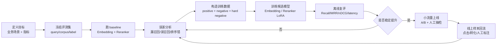

### 11.1 定义本轮目标和验收指标

先明确这一轮解决的不是“让模型更强”，而是一个具体检索问题。

需要固定：

- 业务场景：图搜文、文搜图、截图检索、视频片段检索、多模态 RAG 召回等。
- query 类型：用户自然语言、OCR 文本、图片、视频帧、混合输入。
- corpus 类型：商品、文档、图片、截图、视频片段或页面块。
- 主指标：Recall@K、MRR@K、nDCG@K、人工胜率或线上点击率。
- 约束指标：延迟、吞吐、显存、索引大小、embedding 维度。

本轮开始前要写清楚验收线，例如：

- `Recall@50` 至少提升 3 个点；
- `nDCG@10` 不下降；
- p95 延迟不超过当前线上版本的 1.2 倍；
- 关键 badcase 类别至少修复 50%。

### 11.2 冻结 baseline 和评测集

训练前先冻结一个稳定评测集，否则无法判断提升来自模型、数据还是评测波动。

评测集建议包含：

- `query.jsonl`：每条 query 的文本、图片、视频路径、instruction、业务标签。
- `corpus.jsonl`：候选库内容及多模态字段。
- `qrels.jsonl`：query 和 positive document 的标注关系。
- `slices.json`：按场景、模态、难度、来源拆分的评测切片。

baseline 至少跑两条线：

- 只用 `Qwen3-VL-Embedding` 做 top-k 召回，记录 Recall@K。
- 用 `Qwen3-VL-Embedding top-k + Qwen3-VL-Reranker` 做精排，记录 MRR/nDCG。

产物：

- `eval_retrieval.py`
- `baseline_metrics.json`
- `baseline_topk.jsonl`
- `error_cases_baseline.jsonl`

### 11.3 做误差分析并决定训练数据配方

不要直接把所有样本丢进训练。先看 baseline 错在哪里，再决定本轮数据怎么补。

常见错误类型：

- 漏召回：positive 没进 embedding top-k，说明召回向量空间没拉近。
- 误召回：高相似 negative 排在前面，通常需要 hard negative。
- 排序错：positive 已进 top-k，但 reranker 没排上去。
- instruction 不匹配：训练和推理的任务描述不同。
- 模态缺失：模型只看懂文字，没有学到图片、视频里的关键信息。
- 长尾问题：某些类目、版式、语言或视觉风格持续失败。

误差分析之后，把样本拆成三类：

- `easy positive`：稳定相关，用来维持基础语义对齐。
- `random negative`：明显不相关，用来保持边界。
- `hard negative`：baseline 高分但人工判断不相关，是提升检索质量的核心材料。

### 11.4 构造训练集、验证集和禁止泄漏清单

Embedding 训练样本围绕 `(query, positive, negatives)` 构造，Reranker 训练样本围绕 `(query, document, label)` 或 listwise ranking 构造。

建议的数据文件：

- `train_embedding.jsonl`
- `train_reranker.jsonl`
- `val_retrieval.jsonl`
- `val_reranker.jsonl`
- `test_frozen.jsonl`
- `leakage_blocklist.json`

关键规则：

- `test_frozen` 不参与训练、不参与 hard negative mining、不参与 prompt 调参。
- 同一个 query family 不要同时出现在 train 和 test。
- 训练集里每个 query 至少有 1 个 positive 和多个 negative。
- hard negative 要保存来源：来自 baseline top-k、线上点击失败、人工构造还是同类目混淆。
- 多模态路径、OCR 文本、caption、instruction 必须和推理时一致。

### 11.5 训练候选模型并保留可回滚版本

第一轮优先做 LoRA / QLoRA，不要一开始就全量训练。训练目标是得到一个可比较的候选版本，而不是只看 training loss。

Embedding 训练关注：

- contrastive loss 是否正常下降；
- 同 batch 内 negative 是否足够多样；
- hard negative 比例是否过高导致过拟合；
- 不同 embedding 维度下指标是否稳定。

Reranker 训练关注：

- pointwise / pairwise / listwise 目标和线上排序方式是否一致；
- positive 和 hard negative 是否来自同一个候选池；
- 精排提升是否建立在真实 embedding top-k 上，而不是理想候选集上。

每次训练都要记录：

- base model、adapter 路径、commit id；
- 数据版本和样本计数；
- prompt/instruction 模板；
- LoRA rank、learning rate、batch size、epoch；
- eval 结果和失败样本快照。

### 11.6 离线复评、切片对比和退化检查

候选模型训练完后，必须在同一套 frozen eval 上复评，并且和 baseline 逐项对比。

最小对比表：

```md
# 实验名

## 数据
- train/val/test 数量
- 模态分布
- negative 类型

## 模型
- base model
- LoRA 参数
- loss
- max_length

## 指标
| model | Recall@10 | Recall@50 | MRR@10 | nDCG@10 | p95 latency |
|---|---:|---:|---:|---:|---:|

## 切片
| slice | baseline | candidate | delta |
|---|---:|---:|---:|

## Badcase
- 修复了哪些 query
- 新增了哪些退化 query
- 退化是否可接受
```

复评时重点看：

- 总体指标是否提升；
- 关键业务切片是否提升；
- 原本强势切片是否退化；
- Reranker 提升是否依赖 Embedding 召回质量；
- 延迟、显存和索引大小是否仍能上线。

### 11.7 上线验证、样本回流和下一轮计划

离线指标通过后，不要直接全量替换。先做小流量或影子评测：

- shadow 模式：线上请求同时跑新旧链路，只记录不干预结果。
- A/B 模式：小流量比较点击、转化、人工满意度和投诉率。
- 人工抽检：固定抽样 top-k 结果，看相关性和多样性。

上线后把新样本回流到下一轮：

- 新模型仍然漏召回的 positive；
- 新模型高分误召回的 hard negative；
- 用户点击但标注缺失的潜在 positive；
- 用户跳过、投诉或人工判错的 negative；
- 新增类目、新版式、新语言、新模态样本。

一次完整 loop 的结束条件不是“模型训练完成”，而是：

- 本轮指标和 badcase 结论已经写入实验报告；
- 可上线版本、可回滚版本和失败版本都可复现；
- 新产生的错误样本已经归档；
- 下一轮数据补充方向已经明确。

## 12. 常见坑

### 12.1 坑 1：把 embedding 训练当成普通 SFT

普通 next-token SFT 不会自然学出好的向量空间。应重点关注向量相似度和 ranking 指标。

### 12.2 坑 2：负例太简单

如果负例都是随机图/随机文档，模型很快学会表面区分，但线上还是会错在细粒度相似样本上。

### 12.3 坑 3：只看 reranker 单点分类指标

reranker 最终服务于排序。要在真实召回候选池上看 nDCG/MRR。

### 12.4 坑 4：训练和推理 prompt/instruction 不一致

Qwen3 embedding/reranker 都是 instruction-aware。训练、评测、线上推理的 instruction 不一致，会带来很隐蔽的掉点。

### 12.5 坑 5：多模态字段对不齐

`<image>`、`<video>` 标签数量必须和 `images`、`videos` 字段对齐。positive/negative 也各自有独立的图片/视频字段。

### 12.6 坑 6：视频训练先上强度

视频 token、帧采样、显存都麻烦。建议先 text/image/screenshot 跑通，再加视频。

### 12.7 坑 7：评测集泄漏

hard negative mining 很容易不小心把 test 信息带回 train。先固定 test，只在 train/val 上做 mining。

## 13. 推荐阅读资料

按这个顺序读：

1. Qwen3-VL-Embedding / Reranker 官方仓库  
   https://github.com/QwenLM/Qwen3-VL-Embedding

2. Qwen3-VL-Embedding / Reranker 技术报告（官方仓库内 PDF）  
   https://github.com/QwenLM/Qwen3-VL-Embedding/blob/main/assets/qwen3vlembedding_technical_report.pdf

3. ms-swift Embedding Training 文档  
   https://swift.readthedocs.io/en/latest/BestPractices/Embedding.html

4. ms-swift Reranker Training 文档  
   https://swift.readthedocs.io/en/latest/BestPractices/Reranker.html

5. ms-swift Qwen3-VL-Embedding 示例脚本  
   https://github.com/modelscope/ms-swift/tree/main/examples/train/embedding/qwen3

6. ms-swift Qwen3-VL-Reranker 示例脚本  
   https://github.com/modelscope/ms-swift/tree/main/examples/train/reranker/qwen3

7. Qwen3 text Embedding / Reranker 官方博客，用来理解 text embedding/reranker 的前身  
   https://qwenlm.github.io/blog/qwen3-embedding/

8. Sentence Transformers embedding loss 文档，用来补 loss 直觉  
   https://sbert.net/docs/package_reference/sentence_transformer/losses.html

9. Sentence Transformers cross-encoder/reranker training overview  
   https://sbert.net/docs/cross_encoder/training_overview.html

## 14. 学习检查清单

读完和做完后，学习者应能回答：

- 为什么 embedding 是召回模型，reranker 是精排模型？
- Qwen3-VL-Embedding 和 Qwen3-VL-Reranker 的输入输出分别是什么？
- InfoNCE 为什么适合 embedding 训练？
- hard negative 和 random negative 的区别是什么？
- pointwise reranker 和 listwise reranker 差在哪里？
- 如何把一份业务数据同时转成 embedding 训练集、reranker 训练集和 eval qrels？
- 如何判断训练真的提升了业务，而不是只让 loss 降了？
- 什么情况下才值得把 RL 引入检索链路？

## 15. 一句话路线图

如果当前就要启动项目，不建议先碰 RL。  
先做一个 500 条 query 的小评测集，复现 baseline；然后用 ms-swift 跑 Qwen3-VL-Embedding 的 InfoNCE LoRA；再用 hard negatives 训练 Qwen3-VL-Reranker；最后用固定评测集证明 Recall@K、MRR、nDCG 真的提升。
